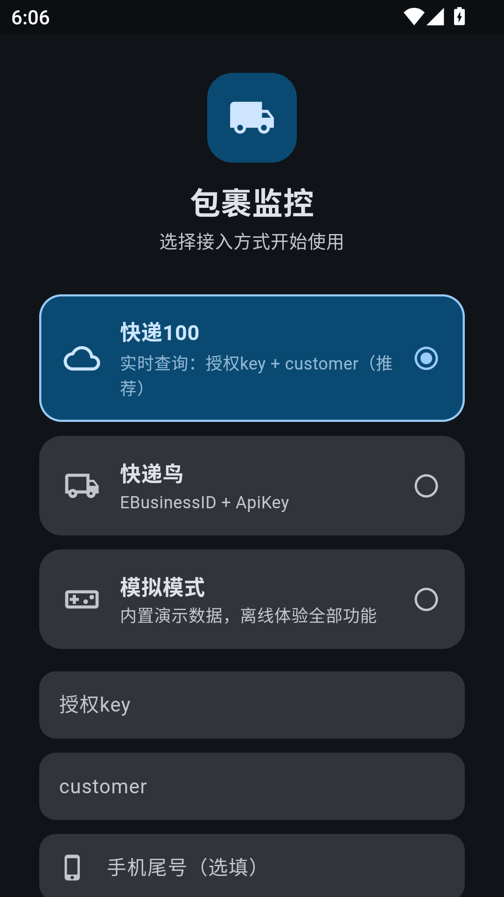
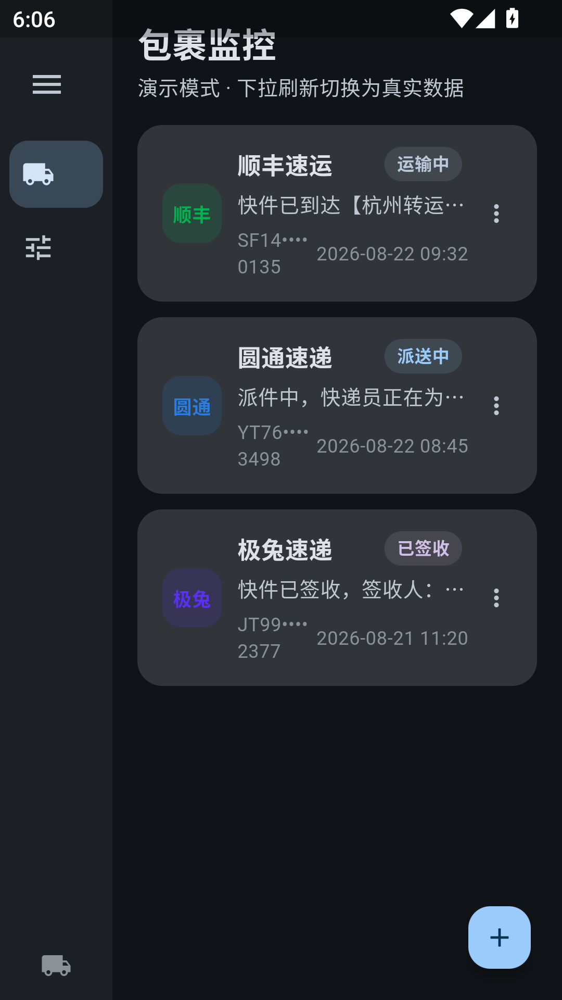
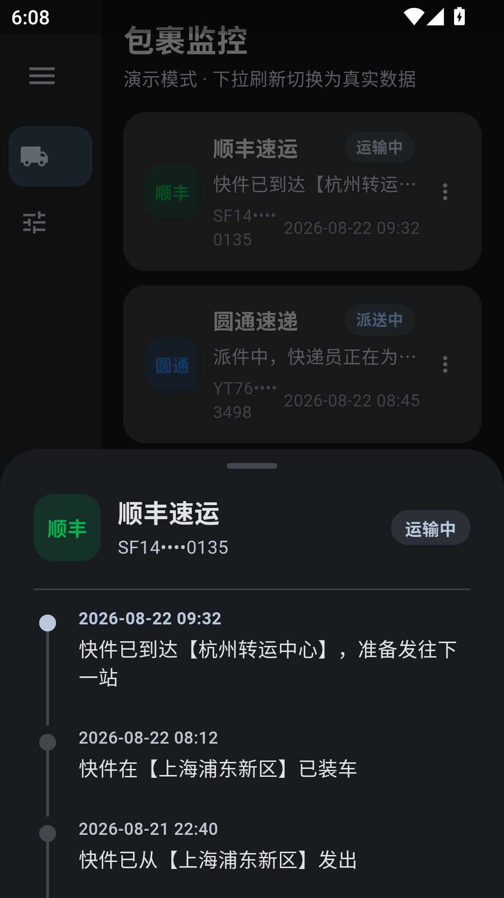
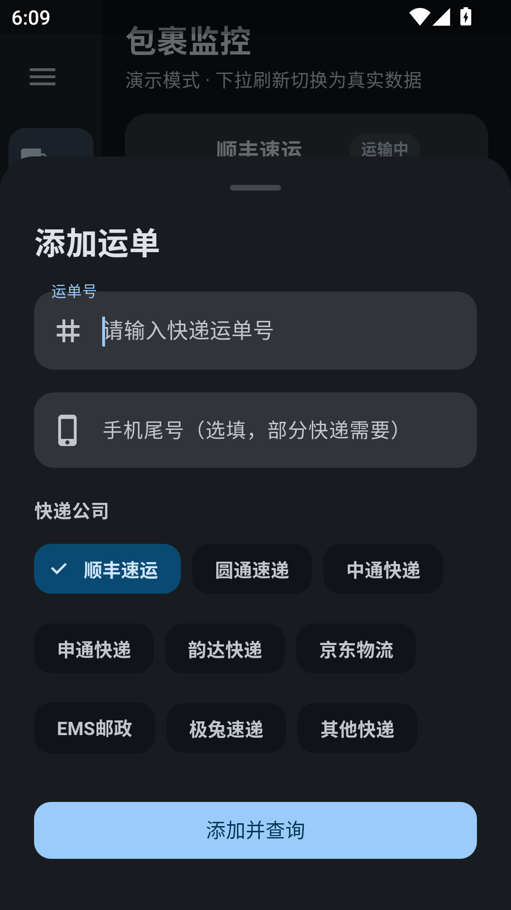

<p align="center"><a href="README.md">English</a> | 简体中文</p>

# 包裹监控（Package Monitor）

包裹物流监控应用，两个版本共用一套 API 服务商体系：

- **Windows 桌面版**（`/` 根目录，Python + PySide6）：定时自动刷新，物流有新动态**系统托盘弹通知**；
- **Android 版**（`/flutter_app` 目录，Flutter）：手机端追踪，Material You 深色风格。

两个版本界面无广告，所有数据只保存在本机。

---

# Android 版（Flutter）

手机端快递物流追踪：手动添加运单号，即时查询物流轨迹，定时自动刷新，最新状态始终排在最前；详情为恒定半屏时间线弹层，适配折叠屏（Flip / Fold）。

| 欢迎页 | 首页 | 详情半屏 | 添加运单 |
| --- | --- | --- | --- |
|  |  |  |  |

## 下载 APK

仓库根目录提供预构建 APK：[`PackageMonitor.apk`](PackageMonitor.apk)（约 21 MB，**不含任何个人凭证**，安装后首次启动自行填入自己的 API 凭证即可）。

## Android 版功能特性

- **数据服务商（欢迎页三选一）**：快递100 API（推荐）/ 快递鸟 API / 模拟模式（离线演示）；
- **包裹卡片**：快递公司徽章、打码运单号、状态标签（运输中 / 派送中 / 已签收）、**轨迹最新状态在前**；
- **详情半屏弹层**：点击卡片从底部滑入恒定半屏时间线（h = 1/2 屏高），最新节点高亮，折叠屏按屏幕高度自适应；
- **手动添加运单**：右下角「＋」输入运单号，快递公司芯片选择（顺丰/圆通/中通/申通/韵达/京东/EMS/极兔/其他），可留手机尾号；
- **自动刷新**：每 30 秒检查一次，达到设定间隔（默认 5 分钟）且存在运单时后台刷新；下拉刷新重置基线；设置页可开免打扰；
- **健壮性**：DNS 失败自动走 IP + Host 头兜底；查询失败展示缓存数据不崩溃；同单号 30 分钟内直接用缓存（防接口锁单）。

## Android 版从源码构建

需要 Flutter 3.24.x（Dart 3.5.x）与 Android SDK 34：

```bash
cd flutter_app
flutter config --android-sdk <你的SDK路径>   # 防止 local.properties 被覆写
flutter pub get
flutter build apk --release
# 产物：build/app/outputs/flutter-apk/app-release.apk
```

## Android 版使用

1. 安装 APK，首次启动选择数据服务商；
2. 快递100：填入授权 key + customer（仓库与 APK 内**不含任何默认凭证**）；也可先玩模拟模式；
3. 「＋」添加运单号 → 选快递公司 → 添加并查询；
4. 之后每 5 分钟自动刷新（可在设置调整），下拉可立即刷新。

## Android 版项目结构

```
flutter_app/lib/
├── main.dart               # 入口、AppState、路由
├── models.dart             # Package / TraceNode（轨迹最新在前）
├── constants.dart          # 快递公司表、演示数据
├── theme.dart              # Material You 深色主题
├── services/
│   ├── kuaidi100_api.dart  # 快递100 实时查询（MD5 签名 + IP 兜底）
│   ├── kdniao_api.dart     # 快递鸟即时查询（DataSign + IP 兜底）
│   └── config_store.dart   # SharedPreferences（凭证按服务商独立存储）
└── screens/
    ├── welcome_screen.dart # 欢迎页（服务商三选一）
    ├── home_screen.dart    # 首页卡片 + 自动刷新 Timer
    ├── detail_sheet.dart   # 半屏详情时间线
    ├── add_sheet.dart      # 添加运单弹层
    └── settings_screen.dart# 设置
```

---

# Windows 桌面版（Python + PySide6）

通过 **API 服务商**按运单号查询快递物流，定时自动刷新，物流有新动态时**系统托盘弹通知**。界面无广告，所有数据只保存在本机。

## 功能特性（桌面版）

- **数据服务商（登录页四选一）**
  1. **菜鸟账号**：手机号短信授权（旧版网页接口，可能随时失效）；
  2. **快递鸟 API**：EBusinessID + AppKey，按运单号即时查询；
  3. **快递100 API**（推荐）：customer（企业ID）+ key（授权key），走官方企业实时查询接口（poll.kuaidi100.com）；不填 key 时可用免费公开查询；
  4. **模拟模式**：无需账号，离线演示完整流程。
- **包裹卡片网格**：砖块式错位布局（行间错位），随窗口宽度自适应每行卡片数（宽窗口每行 3 张）；卡片显示快递公司徽章、打码运单号、最新状态、时间。
- **包裹详情**：点卡片弹出详情 —— 完整物流时间线（倒序，最新在顶部）。
- **手动添加运单**：主界面「＋」输入/粘贴运单号、选快递公司即可查询跟踪；已保存手机号自动作为顺丰等查询尾号。
- **自动刷新**：默认每 5 分钟后台刷新，有新动态托盘通知；设置页可开**免打扰**（静默刷新不弹通知）。
- **设置（抽屉式滑层）**：数据来源说明 / 日志 / API 服务商设置 / 刷新间隔 / 免打扰 / 外观 / 账号。
- **外观**：深色 / 浅色 / 跟随系统三档，内置 8 套配色方案，整站颜色随主题令牌联动（背景、卡片、顶栏、强调色）。
- **健壮性**：单实例运行、关窗驻留托盘、网络异常显示缓存数据不崩溃。

## 数据服务商对比

| 数据源 | 用途 | 说明 |
|---|---|---|
| 菜鸟账号（旧接口） | 账号级包裹列表 | 依赖淘宝旧网页接口，可能不可用，仅作补充 |
| 快递鸟 API | 按单号查询 | api.kdniao.com 即时查询；企业按量计费 |
| 快递100 API | 按单号查询 | poll.kuaidi100.com 企业实时查询；凭据见官网控制台（customer=企业ID，key=授权key），应用按官方签名调用 |
| 模拟模式 | 离线演示 | 内置演示包裹，不联网 |

> 快递100 凭据获取：登录 <https://api.kuaidi100.com/> → 控制台可查看企业ID(customer) 与授权key。
> 官方实时查询接口文档：<https://api.kuaidi100.com/document/5f0ffb5ebc8da837cbd8aefc.html>

## 目录结构

```
cainiao-monitor/
├── main.py                     # 程序入口
├── requirements.txt            # 运行依赖
├── requirements-dev.txt        # 打包依赖
├── build_full.bat / build_lite.bat          # 一键打包（完整版 / 精简版）
├── build_full_onefile.bat / build_lite_onefile.bat  # 可选单文件打包
├── cainiao_monitor_full_onedir.spec  # 完整版目录版配置（默认）
├── cainiao_monitor_lite_onedir.spec  # 精简版目录版配置（默认）
├── cainiao_monitor_full.spec / cainiao_monitor_lite.spec  # 单文件配置（可选）
├── README.md                   # 本说明
├── 使用说明.md                  # 完整使用说明
├── create_project.py           # 一键重建源码（自解压脚本）
├── tools/
│   └── gen_icon.py             # 生成应用图标 icon.ico
├── resources/                  # 图标等资源
├── app/
│   ├── config.py               # 配置管理（服务商密钥/设置/缓存，JSON）
│   ├── constants.py            # 快递公司表、配色、接口常量
│   ├── models.py               # 数据模型（包裹/轨迹节点）
│   ├── logger.py               # 日志
│   ├── api/
│   │   ├── http_client.py      # 统一 Session/超时/重试/异常
│   │   ├── wuliu.py            # 淘宝物流助手：列表/详情抓取与容错解析
│   │   ├── kdniao.py           # 快递鸟 API 查询
│   │   └── kuaidi100.py        # 快递100 查询
│   ├── core/
│   │   ├── monitor.py          # 后台监控线程（轮询+变化检测）
│   │   ├── notifier.py         # 系统托盘与通知
│   │   └── workers.py          # 线程分离工具
│   └── ui/
│       ├── theme.py            # 主题令牌系统（深浅色+配色方案）
│       ├── icons.py            # 程序化图标（托盘/徽章/状态点）
│       ├── login_window.py     # 登录窗口（服务商选择/凭据）
│       ├── main_window.py      # 主窗口（卡片网格+托盘+设置抽屉）
│       ├── package_card.py     # 包裹卡片控件
│       ├── detail_dialog.py    # 详情弹窗（时间线）
│       ├── add_package_dialog.py # 手动添加运单
│       └── staggered_layout.py # 砖块式错位布局
└── tests/
    ├── test_core.py            # 核心逻辑测试（可离线）
    └── test_ui_smoke.py        # UI 冒烟测试（离屏截图）
```

## 运行（开发模式）

需要 Python 3.10+：

```bat
pip install -r requirements.txt
python main.py --simulate   # 模拟模式体验（无需账号）
python main.py              # 登录页选择服务商
```

## 打包成独立 .exe

默认「目录版」（onedir，运行零解压，避免 MSVCP140 解压报错）：

```bat
pip install -r requirements-dev.txt
python tools\gen_icon.py
pyinstaller --clean --noconfirm --distpath dist_lite --workpath build_lite cainiao_monitor_lite_onedir.spec
```

产物在 `dist_lite\CainiaoMonitorLite\`：双击 exe 或 `启动菜鸟监控.cmd` 启动。

- **完整版**（含内嵌浏览器，可网页登录菜鸟）：`build_full.bat` / `cainiao_monitor_full_onedir.spec`
- **精简版**（无内嵌浏览器，体积更小）：`build_lite.bat`，登录用「系统浏览器 + 粘贴 Cookie」
- 杀毒软件偶发误报 PyInstaller 产物，添加信任即可。

## 使用（推荐：快递100）

1. 打开软件 → 登录页选 **快递100 API**；
2. 填入 customer（企业ID）与 key（授权key），或勾选免费公开查询；
3. 进入主界面 →「＋」粘贴运单号、选快递公司 → 查询添加；
4. 程序每 5 分钟自动刷新，有新动态托盘通知。

> 菜鸟账号（手机号授权）依赖旧版网页接口，仅作补充；快递鸟 / 快递100 按单号查询最稳定。

## 数据与本机隐私

- 所有登录信息（Cookie、手机号、API 密钥）仅保存在本机 `%APPDATA%\CainiaoMonitor\`，不上传任何服务器；
- **分享前清除个人信息**：软件设置 →「清除我的信息」，或手动删除 `%APPDATA%\CainiaoMonitor` 目录；
- 本项目为个人工具，不隶属阿里/菜鸟/快递100 等任何公司；接口可能随时调整，因使用产生的后果由使用者自行承担。

---

# API 申请教程（快递100 / 快递鸟）

> 两个版本通用。两种服务都是「按运单号查询」，免费额度个人日常够用；用量大需付费升级。
> 凭据只存在本机，填到对应版本的服务商设置里即可使用（桌面版登录页 / Android 版欢迎页）。

## 快递100（推荐）

1. 打开 **<https://api.kuaidi100.com/>** 注册账号并登录（手机号即可）；
2. 完成**实名认证**（个人认证即可，一般即时通过）；
3. 控制台开通「**实时快递查询**」服务（有免费试用额度）；
4. 在「控制台 → 账号信息/密钥」查看两项凭据：
   - **customer**（企业ID / 授权码）
   - **key**（授权 key）
5. 桌面版登录页 / Android 版欢迎页选「**快递100**」，填入 customer 与 key 即可。

- 官方实时查询接口文档：<https://api.kuaidi100.com/document/5f0ffb5ebc8da837cbd8aefc.html>
- 仅桌面版：不填 key 时自动用「免费公开查询」兜底（部分快递需手机尾号）。

## 快递鸟

1. 打开 **<https://www.kdniao.com/>** 注册账号并登录；
2. 「用户中心 → 实名认证」完成认证（免费）；
3. 「服务中心」开通「**物流跟踪（即时查询）**」接口（免费版每日有查询上限）；
4. 「用户中心 → 我的信息/密钥管理」查看两项凭据：
   - **EBusinessID**（用户ID）
   - **AppKey**（密钥）
5. 桌面版登录页 / Android 版欢迎页选「**快递鸟**」，填入 EBusinessID 与 AppKey 即可。

- 注意：免费额度用完后查询会提示额度不足（次日恢复或付费升级），此时可改用快递100。
